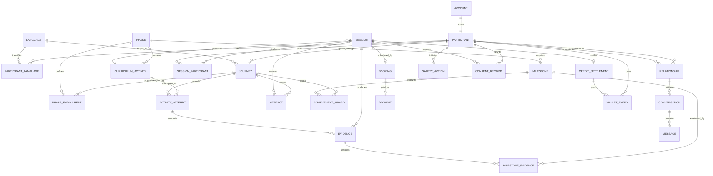
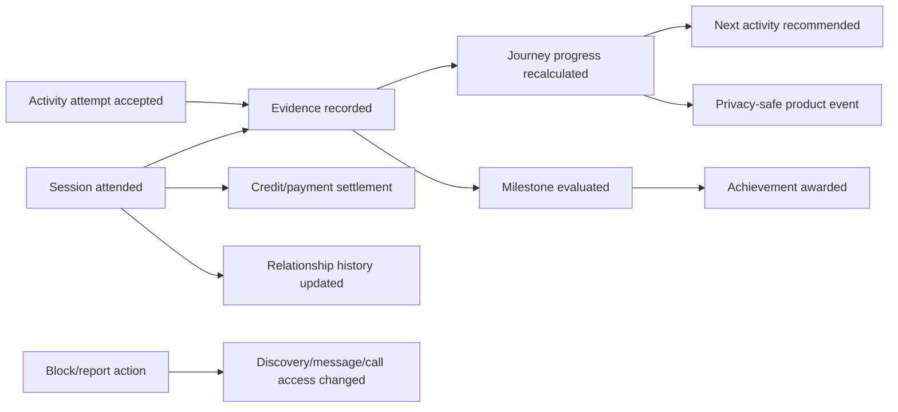
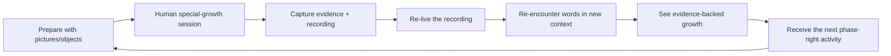

# Nurilang Beta Readiness Audit

**Audit snapshot:** 2026-07-13
**Decision:** not ready for an open, paid, or unsupervised public beta
**Recommended next release:** a small, adult-only, invitation-only Phase 1A pilot with one audited target language, real human facilitation, and commerce disabled

This document is the operating view of the product: what Nurilang is trying to do, what the repository actually does, how the data should connect, which parts of the Growing Participator Approach (GPA) are non-negotiable, and what must be true before people are invited to learn or nurture through the product.

The strongest part of the repository is the idea: a welcoming visual world, a research-rich six-phase curriculum, and a clear rejection of shallow streak/XP mechanics. The default local beta build now presents a narrower, more honest Phase 1A product, while the larger connected-learning, community, and marketplace system remains partly prototype infrastructure. The safe path is to keep that boundary firm, prove the first learning loop with real adults and trained nurturers, and then widen language, phase, community, and commerce coverage.

---

## 1. Release verdict

### What is already valuable

- The research corpus in `research/phase1.txt` through `research/phase6.txt` gives the product a real pedagogical spine.
- `src/lib/phases.ts` presents the six-phase journey in approachable product language.
- `src/app/onboarding/page.tsx` already supports selecting multiple home languages and one initial target language.
- The landing page, mascot family, globe, courses, practice screens, and session room make the method feel tangible.
- Translation coverage in `src/lib/i18n.ts` is structurally broad, and the product understands right-to-left layout at the language-model level.
- Clerk, Convex, messaging, requests, parties, and WebRTC signaling provide a reasonable scaffold for an account-backed product.
- The current working tree now includes account-derived profile identity, per-language journey state, dated achievements, gradual immersion, production fail-closed behavior, and default-off gates for unfinished human/community/commerce paths.
- A clean production build and a local mobile browser journey passed. Deployment, legacy-profile migration, adversarial security, native-language review, real-user facilitation, and production operations still remain release gates.

### Why an open beta would be unsafe or misleading today

1. Only Phase 1A has an executable learning loop. Phases 2–6 are now correctly presented as method previews, but their distinct engines, artifacts, evidence, and human-session plans do not yet exist.
2. Progress is primarily awarded by client behavior and elapsed timers, not server-validated learning evidence or a completed human session.
3. Seeded people and simulated human behavior are removed or explicitly demo-gated in the default build, but the product still has no verified supply of trained nurturers for a real pilot.
4. New target selection and legacy target routes no longer silently borrow another language's deck. However, native-reviewed curriculum and recorded audio coverage are still much narrower than the selectable language set.
5. The trust-and-safety system required for stranger discovery, messaging, calls, and paid nurturing is not yet complete.
6. Commerce and time credits are not yet tied to authoritative payment webhooks and attended-session settlement.
7. The original GPA materials include publication and translation conditions. A sent or granted permission record is not present in the repository; `docs/THOMSON-PERMISSION-EMAIL.md` appears to be a draft, not proof of rights.
8. Invitation enforcement, adult-only acceptance, support ownership, moderation operations, monitoring, backups, and deployed Clerk/Convex smoke tests are not yet proven. Maintained product surfaces now use Nurilang, but legacy domains and historical artifacts still require a deliberate redirect/archive policy.

### Safe closed-beta boundary

This is the required release scope, not a statement that every boundary is already enforced. In particular, adult-only eligibility, invitation-only access, a single audited pilot language, verified nurturer operations, and production support depend on external configuration or work that is not yet complete.

The first beta should be all of the following:

- Adults 18+ only.
- Invitation-only, with a named support contact and explicit beta expectations.
- One audited target language at launch. Russian is the strongest candidate to evaluate first because a large prerecorded asset set exists, but it still requires native-speaker content review. English or Japanese should not be added merely because audio folders exist.
- Phase 1A only: the first 30–40 hours, or an even smaller first-session pilot until the complete 15-meeting sequence is executable.
- One initial target language per new account; multiple home languages remain allowed.
- Solo picture/listening activities described as preparation and re-living tools, not substitutes for human participation.
- Real nurturers manually recruited, verified, trained, scheduled, and observed by the beta team.
- No public globe discovery, unmoderated direct messaging, open calls, paid marketplace, or purchasable credits until the corresponding release gates pass.
- Phases 2–6 visible only as method previews. They must not look playable or complete until each has its own activity engine, artifacts, evidence, and human-session plan.
- Every seeded person, event, metric, or conversation visibly labeled “example” or “demo,” or removed from the beta build.

This scope is intentionally narrow. It is enough to test the product's real promise: can a new person understand the method, hear meaningful speech, respond nonverbally, build a relationship with a nurturer, re-live a recording, and want to return?

### Local remediation verification — 2026-07-13

The following checks passed against the local default beta configuration. They establish a viable engineering baseline; they do **not** establish open-beta readiness or validate external production configuration.

- A fresh user completed the mobile onboarding path with multiple home languages and exactly one target language; optional steps could be skipped and gradual immersion remained the default.
- The user completed a ten-round Phase 1A listening activity and saw progress and a dated achievement update.
- Adding a second target journey, switching between journeys, and returning preserved independent progress.
- Direct URLs could not bypass the Phase 1A/1B speaking gate; Phases 2–6 displayed method-preview states without executable “Start” actions.
- Schedule and direct-session surfaces showed only clearly labeled AI behavior in the default configuration; seeded humans, messaging, stranger calls, forum/events, nurture studio, marketplace, and wallet paths were hidden or redirected behind default-off feature gates.
- Mobile layout had no horizontal overflow on the exercised path.
- Root TypeScript, Convex TypeScript, diff-whitespace checks, and a clean Next.js production build passed. The design audit passed 12 of 13 automated heuristics with no critical failure; the remaining heuristic did not recognize an existing staggered-reveal implementation.
- The public landing route's first-load JavaScript was reduced from roughly 839 kB to 173 kB. Authenticated app routes remain large and need a dedicated bundle-reduction pass.

---

## 2. Sources reviewed and source-of-truth order

### Research sources

| Source | Product meaning |
|---|---|
| `research/phase1.txt` | First 100 Hours; Phase 1A listening/nonverbal response and Phase 1B constrained two-way interaction |
| `research/phase1-authentic-inventory.md` | Inventory and fidelity check for Phase 1 activities |
| `research/phase2.txt` | 150 hours of story-building: 2A 50h, 2B 75h, 2C 25h |
| `research/phase2-3-story-library.md` | Story resources and the bridge from picture stories into shared stories |
| `research/phase3.txt` | 250 hours of shared-story work: 3A 100h, 3B 75h, 3C 75h |
| `research/phase4.txt` | 500 flexible hours of deep-life conversations with mentors |
| `research/phase5.txt` | 500 hours of native-to-native discourse, clarification, and communities of practice |
| `research/phase6.txt` | Ongoing self-sustaining participation; Phase 6 is a way of living, not a timed course |
| `research/gpa-research.json` | Detailed activity research used to curate the product model |

### Product and implementation sources

| Area | Primary repository paths |
|---|---|
| Curriculum model | `src/lib/phases.ts`, `src/lib/types.ts`, `src/app/(app)/courses/` |
| Content and language coverage | `src/lib/languages.ts`, `src/lib/vocab.ts`, `src/lib/tts.ts`, `public/audio/` |
| Onboarding and translation | `src/app/onboarding/page.tsx`, `src/lib/i18n.ts`, `src/lib/onboardingOptions.ts` |
| Local progress and immersion | `src/lib/store.tsx`, `src/lib/achievements.ts` |
| Account sync | `src/components/Providers.tsx`, `src/components/CloudProfileBridge.tsx`, `convex/profiles.ts`, `src/middleware.ts` |
| Practice and sessions | `src/app/(app)/practice/`, `src/app/(app)/session/page.tsx`, `src/app/(app)/nurture/page.tsx` |
| Scheduling and people | `src/app/(app)/schedule/page.tsx`, `src/app/(app)/world/page.tsx`, `src/lib/nurturers.ts`, `convex/requests.ts` |
| Community and calls | `src/app/(app)/forum/page.tsx`, `src/app/(app)/events/page.tsx`, `convex/messages.ts`, `convex/calls.ts`, `src/components/CallProvider.tsx` |
| Commerce | `src/app/(app)/wallet/page.tsx`, `src/app/(app)/marketplace/page.tsx`, `src/lib/credits.ts`, `convex/credits.ts` |
| Backend schema | `convex/schema.ts` |
| Public acquisition | `src/app/page.tsx`, `src/app/_landing/`, `src/app/layout.tsx`, `src/app/early/page.tsx` |
| Existing internal claims | `docs/ROADMAP.md`, `docs/AGENT_BRIEF.md`, `docs/SETUP-BACKEND.md` |

### Source-of-truth rule

When sources disagree, use this order:

1. The original phase research for method and sequence.
2. A separately approved Nurilang curriculum specification that documents any intentional adaptation.
3. Executable tests and server behavior for claims about what works.
4. Interface copy and roadmap documents only after they have been reconciled with the above.

`docs/ROADMAP.md` currently uses “built and live” for experiences that include prototype or seeded behavior, while `docs/AGENT_BRIEF.md` contains stale type signatures and language-coverage descriptions. Neither should be treated as launch evidence without updating it.

---

## 3. Product doctrine: non-negotiable behavior

Nurilang should be evaluated against these rules, not against generic language-app conventions:

1. **The unit of growth is participation.** A person is not collecting isolated answers; they are becoming able to participate in another languacultural world.
2. **Comprehension precedes production.** Phase 1A asks the grower to point, act, arrange, and respond—not perform speech.
3. **Meaning is carried by shared context.** Pictures, objects, actions, stories, experiences, and people establish meaning. Translation is not the practice engine.
4. **Hearing precedes reading in the early journey.** Phase 1 has no writing. Written target-language answers must not short-circuit the ear.
5. **The nurturer is a person, not a content-delivery avatar.** The relationship and shared past are part of the curriculum.
6. **Recasting replaces correction.** A nurturer naturally says a better version; the experience must not feel like error punishment.
7. **Recordings become artifacts.** Talking Picture Dictionaries, session samples, clarified stories, word–sentence–word recordings, retellings, and a listening library carry learning across time.
8. **Evidence is phase-specific.** Time alone cannot prove comprehension, participation, or readiness.
9. **No streak debt.** Missing a day does not erase growth. Use dated, evidence-backed milestones rather than XP, leagues, streak anxiety, or deceptive urgency.
10. **Immersion is graduated.** The interface should not become inaccessible on day one. Target-language interface exposure grows with comprehension.
11. **Phase 6 is ongoing.** It begins around the 1,500-hour framework boundary but is not “completed” by adding another fixed block of app time.
12. **The product must tell the truth.** AI buddies, example nurturers, browser speech, simulated sessions, and real humans must always be distinguishable.

---

## 4. Current implementation map

The current system is a hybrid: the browser owns the active learning state, a Convex profile stores a broad JSON copy plus a few indexed fields, and several social features have their own server tables. The learning, social, session, evidence, and economic graphs are not yet one authoritative system.

```mermaid
flowchart LR
  Visitor["Visitor"] --> Clerk["Clerk account"]
  Clerk --> Onboarding["Onboarding UI"]
  Onboarding --> AppStore["AppProvider / browser state"]

  AppStore <--> Local["localStorage profile cache"]
  AppStore <--> Bridge["CloudProfileBridge"]
  Bridge <--> ProfileRow["Convex profiles row<br/>indexed fields + data JSON"]

  AppStore --> Profile["Profile<br/>home languages + active target + role"]
  Profile --> Journeys["Optional language journeys<br/>progress snapshots"]
  Profile --> Bookings["Bookings array"]
  Profile --> Achievements["Dated achievement map"]

  Practice["Practice pages"] --> Complete["client completeActivity()"]
  SessionUI["Session room"] --> Complete
  Complete --> AppStore

  StaticNurturers["src/lib/nurturers.ts<br/>explicit seeded-demo data"] -. "demo flag only" .-> Schedule["Schedule prototype"]
  StaticNurturers -. "demo flag only" .-> Forum["Forum prototype"]

  ProfileRow -. "community flag; off by default" .-> World["World roster"]
  World --> Requests["Convex session requests"]
  Requests --> Messages["Convex messages / voice notes"]
  Messages --> Calls["Convex WebRTC signaling + ICE"]

  Parties["Convex parties + guests"] -. "events flag; off by default" .-> Events["Events prototype"]
  WalletLocal["Browser wallet state"] <-. "commerce flag; off by default" .-> WalletAPI["Convex wallets + ledger"]

  Calls -. "not authoritative learning evidence" .-> Journeys
  Bookings -. "not reliably settled to attendance" .-> WalletAPI
  Parties -. "not phase activity evidence" .-> Journeys
```

### Current-state observations

- `src/lib/store.tsx` is the practical source of truth for the active profile. It now includes `LanguageJourney`, exact minutes, activity attempts, deduplicated word IDs, dated achievements, and weekly-window metadata. Local add/switch-journey testing passed, but the state remains client-authored and still needs legacy-profile migration and cloud-conflict testing.
- `convex/schema.ts` still stores the full profile as `data: v.any()` alongside structured fields. This enables round-tripping but prevents meaningful server validation and safe partial updates.
- The social backend is more normalized than the learning backend: requests, messages, calls, parties, guests, wallets, and ledger entries have separate tables.
- A booking, call, party attendance, recording, curriculum activity, and achievement do not share a common server-side evidence record.
- Seeded forum, event, nurturer, and human-session behavior is unavailable in the default beta configuration and requires explicit demo flags. The underlying prototype pages and local data are not a durable or verified community.
- `src/lib/nurturers.ts` contains compelling character concepts, but none should be treated as a verified person's online status, session count, rating, certification, or availability until linked to an account-backed review and scheduling record.
- `src/app/(app)/session/page.tsx` defaults to clearly labeled AI picture-card practice; any timer-generated “human” simulation is restricted to an explicit seeded-demo build.
- `src/lib/languages.ts` constrains new targets to the content registry and legacy unsupported routes return to language selection rather than borrowing Spanish. Prerecorded audio folders currently exist for English, Japanese, and Russian; browser speech synthesis is not equivalent to native-recorded, dialect-reviewed curriculum audio.
- Community exchange, nurture studio, commerce, forum, and events are default-off release boundaries enforced in the UI, middleware, and relevant server functions. Enabling a flag does not satisfy the operational, moderation, reliability, or economic gates described below.

---

## 5. Target data model

The target model separates identity, language identity, per-language growth, curriculum, human participation, evidence, safety, and money. The active target language is a user preference; it is not the place where progress itself lives.

### Required entity responsibilities

| Entity | Required invariants |
|---|---|
| `ParticipantLanguage` | One row per language and relationship: home, nurtures, learning, or heritage; proficiency and dialect are optional attributes, not inferred from a flag |
| `Journey` | Exactly one target language; owns phase, minutes, words encountered, artifacts, attempts, and achievements; changing the active target never moves progress between languages |
| `PhaseEnrollment` | Start/end state, readiness evidence, mentor/nurturer relationship, and phase-specific plan; Phase 6 remains open-ended |
| `CurriculumActivity` | Canonical ID, phase/subphase, prerequisites, role instructions, supported languages, content version, required artifacts, and evidence rules |
| `Session` | Real start/end timestamps, activity, target language, participants, consent, attendance, and completion state; a booking is not attendance |
| `Evidence` | Server-created or server-accepted record such as correct nonverbal selections, a nurturer-confirmed session, a recording, clarified story, or retelling; never just a client-supplied hour total |
| `Artifact` | Versioned Talking Picture Dictionary, audio sample, word log, listening-library item, story, retelling, or reflection with owner and consent policy |
| `AchievementAward` | Dated and immutable; cites the milestone/evidence that earned it; scoped to a language journey unless genuinely account-wide |
| `Relationship` | Explicitly accepted connection with block/report state; map visibility and messaging require appropriate consent |
| `Payment` / `CreditSettlement` | Provider webhook and attended session are authoritative; idempotent; cannot be minted by a client |
| `SafetyAction` | Report, block, mute, moderation result, appeal, and audit history with access controls |

### Cross-system event graph

Every important action should publish one domain event and let downstream systems respond:

This event flow is how the app “governs itself”: each visible result comes from an authoritative fact, and retries remain idempotent.

---

## 6. End-to-end user journeys

### 6.1 Visitor to first meaningful comprehension

1. A visitor sees one clear promise: understand and speak through people, shared context, and a child-like comprehension-first sequence.
2. “Start growing” opens sign-up, not sign-in. The selected role or campaign context survives authentication.
3. Before personal data is requested, the app explains the terms **grower**, **nurturer**, and **home language** in the visitor's interface language.
4. The grower selects one or more home languages. Search uses both English names and endonyms; keyboard and screen-reader behavior are complete.
5. The grower selects exactly one initial target language. Only beta-supported target languages are selectable; upcoming languages are labeled and can collect interest.
6. The grower selects motivations, interests, location at city level, daily availability, and whether they are open to exchange. Optional steps say why the data helps and can be completed later.
7. Immersion defaults to gradual. A clear preview shows what changes later.
8. The completion screen states the first action in plain language: “Listen, then point. You do not need to speak.”
9. The first activity introduces two concrete items, says each no more than needed, asks a randomized comprehension question, and adds one item only after reliable understanding.
10. Completion records an actual attempt and the unique encountered items. The dashboard recommends the next activity and explains the first human session.

**Success definition:** the person can describe what to do, completes one comprehension activity without translation, and knows how to continue.

### 6.2 First nurturer relationship

1. The grower sees only verified, available nurturers for the active language and appropriate phase.
2. The profile distinguishes native variety, city/region, availability, verified status, method training, paid rate, and exchange preference.
3. The grower requests or books a curriculum-specific session—not a generic call.
4. Both parties see the same activity plan, required objects/cards, recording policy, and roles.
5. The call performs device and network checks, confirms consent, and provides block/report access throughout.
6. The nurturer follows phase-appropriate pacing; Phase 1A never asks the grower to repeat or read.
7. At the end, both participants confirm attendance; the nurturer records simple evidence and the app saves permitted artifacts.
8. Only then do progress, achievement, credit, payment, and recommendations update.

**Success definition:** a stranger can become a safe, accountable nurturer relationship, and the learning record proves what occurred.

### 6.3 Ongoing growth loop

The dashboard should answer four questions without requiring exploration:

- What am I growing into?
- What do I do next?
- Who am I doing it with?
- What changed because of my last participation?

### 6.4 Adding another target language later

1. The profile offers “Add a language journey” only after onboarding.
2. The person chooses another supported target and receives a new zeroed journey.
3. Switching active language changes curriculum, nurturers, recordings, achievements, recommendations, weekly activity, and immersion context together.
4. Account-wide settings and home languages remain shared.
5. Existing progress is never copied into the new target and never overwritten when switching back.

### 6.5 Nurturer journey

1. A nurturer chooses every language and variety they can genuinely nurture; these are not inferred from all home languages.
2. Identity, adult eligibility, location, language variety, availability, and payment/exchange preferences are verified.
3. Training demonstrates GPA principles and includes observed practice, not a self-issued client quiz alone.
4. Certification is issued by an authorized reviewer, versioned to a method curriculum, and can expire or be suspended.
5. The nurturer receives phase-specific session plans and cannot accept phases they are not cleared to guide.
6. Session evidence, grower safety, attendance, reviews, disputes, credits, and payouts update from server records.

### 6.6 Exchange and community journey

1. A person appears in discovery only after explicit opt-in.
2. Matching considers complementary languages, timezone, availability, goals, phase, and safety—not a permanently “online” seed flag.
3. A request must be accepted before messaging or calling.
4. Block/report ends discovery, message, and call access immediately in both directions.
5. Group events identify a host, capacity, language, phase suitability, conduct rules, and a real room or physical location.
6. Community contribution can support retention, but it must never fabricate social proof.

---

## 7. Six-phase curriculum fidelity audit

### Program boundary

The research describes **1,500 recommended hours of special-growth participation across Phases 1–5**, followed by an ongoing Phase 6. `src/lib/phases.ts` now models the first five phases as 100 + 150 + 250 + 500 + 500 hours and places Phase 6 at hour 1,500. This is the correct top-level boundary. It must not be converted back into a 2,000-hour finite course.

### Phase-by-phase requirements

| Phase | Research-faithful structure | Required product evidence | Current executable status and risks |
|---|---|---|---|
| **1 — Connecting** (0–100h) | 1A: meetings 1–15, 30–40h, listening and nonverbal response, first 300+ words. 1B: meetings 16–40, roughly 50–60h, more listening plus constrained two-way interaction, another 600+ words. Start with two items, add one at a time, randomize, newest/weakest most often. No writing; no forced production; no translation as the practice mechanism. | Correct pointing/acting/arranging; unique word encounters; session sample; Talking Picture Dictionary; re-living activity; nurturer confirmation; only late-1B speaking evidence. | The richest implementation. Vocabulary, listening, speaking, repeat, and a Dirty-Dozen-style session exist. Direct speaking/repeat routes are now gated until 40 hours, Phase 1A vocabulary hides written target words, and acceleration requires explicit demo flags. Client-only completion still undermines authoritative evidence, and the complete 40-meeting progression is not encoded. |
| **2 — Emerging** (100–250h) | 2A 50h: grower leads wordless-picture discussion to loosen speech. 2B 75h: nurturer leads story-building; grower clarifies recordings. 2C 25h: life stories with simple drawings; postpone if too difficult. Small talk grows naturally. | Wordless story pages, recorded whole story, clarification checkpoints, word–sentence–word items, re-listening, retelling, and autobiographical picture story. | `src/lib/phases.ts` currently displays 50/80/20, which conflicts with 50/75/25 in `research/phase2.txt`. Phase 2 is now preview-only without executable practice links. No durable story builder, clarification loop, listening library, or life-story artifact exists. |
| **3 — Becoming Knowable** (250–500h) | 3A 100h: bridge stories, scripts of life, action cartoons, shared experiences, massaging. 3B 75h: host stories as shared stories and deliberately wider social relationships. 3C 75h: more abstract/expository familiar topics and greater activity flexibility. Reading may become possible; it is not an automatic day-one requirement. | Original and massaged recordings, bridge/host story library, retellings, shared-experience record, scripts-of-life set, vocabulary log, and evidence of increasingly varied relationships. | `src/lib/phases.ts` collapses the research into two 125h product parts. That is not a faithful representation of 3A/3B/3C. Phase 3 is preview-only; the record-and-massage loop and host-story workflow are descriptive, with no dedicated artifact or review engine. |
| **4 — Deep Personal Relationships** (500–1,000h) | 500 flexible hours with mentors. The research offers three major activities—life stories, walk-of-life conversations, and detailed observation—plus earlier-phase supplements. It explicitly asks participants to set a personal distribution; it does not mandate a universal 200/200/100 schedule. | Mentor relationships, consented life-story recordings, clarification notes, vocabulary recordings, observation reports, walk-of-life topic map, reciprocal sharing, and feedback recordings. | The fixed 200/200/100 parts in `src/lib/phases.ts` are a product invention and should be labeled “example plan” or made configurable. Phase 4 is preview-only. Deep relationship, mentor, and sensitive-recording safeguards are not modeled. |
| **5 — Widening Understanding** (1,000–1,500h) | 500 hours centered on native-to-native discourse. Rough guidance: clarify 100–125 recorded hours, often spending about three hours per recorded hour; up to 100–200 hours of ordinary host social life may count, but ordinary interaction cannot replace supercharged work. Native-to-native material belongs here because it is finally in the growth zone. | Rights-cleared discourse recordings, provenance, line-by-line clarification state, vocabulary harvest, next-day retelling, re-listening history, mentor notes, and community-of-practice participation. | Current Collect/Clarify/Belong splits are useful product scaffolding but are not research-mandated allocations. There is no native-media rights/provenance system, discourse clarification player, or complete listening library. Showing fast native media too early would violate the temporal logic of GPA. |
| **6 — Ever Participating, Ever Growing** (1,500h+) | Ongoing lifestyle participation, not a timed curriculum completion. Growth comes from living in host communities; targeted 100/300-hour pushes and earlier-phase remedial tools remain available. Phase un-6 is the plateau where participation no longer produces meaningful growth. | Host-hours audit, needs analysis, community participation, targeted discourse plan, periodic self/mentor review, remedial projects, and contribution as a nurturer. | The current working tree correctly moves Phase 6 toward `ongoing` with zero fixed completion hours. Most Phase 6 activities remain descriptive. Phase 6 must have no finite completion badge and should never imply a user is “done.” |

### Research-fidelity rules for implementation

- Canonical activity IDs in `src/lib/phases.ts` must be the same IDs written by practice, session, evidence, recommendation, and achievement systems.
- A route is not a curriculum implementation. Every playable phase activity needs its own instructions, prerequisites, nurturer behavior, grower behavior, artifacts, evidence, accessibility behavior, and supported-language matrix.
- Activity availability must depend on phase/subphase readiness. Phase 1A cannot expose Power Phrases, repetition, marketplace role-play, or written-word study as the default next step.
- Placement may recommend a starting activity, but it must not grant hundreds of hours, vocabulary, relationships, artifacts, or achievements that never occurred.
- AI can help prepare content, generate prompts, or support solo re-living. It cannot be represented as the host community or silently stand in for evidence of a human relationship.
- Milestones should describe what a grower and host person can now do together. Hour thresholds can support pacing but cannot be the only proof.
- A content capability registry must determine which language supports which activity, audio variety, cards, captions, nurturer pool, and phase. Never silently fall back to Spanish.

### Rights and attribution gate

The research files state that informal copying/distribution is allowed while formal publication or translation requires permission. A commercial or publicly distributed app is not safely assumed to be informal distribution. Before public beta:

1. Obtain written permission covering digital publication, adaptation, translation, commercial use, attribution, and future updates.
2. Record the grant, restrictions, permitted excerpts, and attribution text in the repository or legal system.
3. Review every long curriculum description and translation against that grant.
4. Add appropriate attribution and methodology disclaimers in-product.
5. Do not describe Nurilang as officially endorsed unless the permission explicitly says so.

---

## 8. Findings by priority

Status labels used below:

- **Open:** release blocker remains.
- **In progress:** code exists in the current working tree, but release verification or migration is incomplete.
- **Locally remediated:** the unsafe default behavior is corrected and locally verified; deployment or expansion gates remain.
- **Prototype:** useful demonstration, not safe to describe as production behavior.

### P0 — blocks any open beta

| ID | Finding | Evidence / paths | Required closure |
|---|---|---|---|
| P0-01 | Account ownership and cross-account isolation require full verification. Earlier profile, call, and credit APIs accepted client-supplied identity or insufficient participant checks. | `convex/profiles.ts`, `convex/calls.ts`, `convex/credits.ts`, `src/components/CloudProfileBridge.tsx` | Identity is now derived from auth and participant checks were tightened; local account/journey switching passed. Add forged-ID security tests, shared-browser tests, migration tests, and deployed verification. **In progress.** |
| P0-02 | Progress is not authoritative learning evidence. A client can call completion, accelerate timers, repeat attempts, or submit totals. | `src/lib/store.tsx`, `src/app/(app)/session/page.tsx`, `src/app/(app)/nurture/page.tsx` | Remove demo acceleration outside explicit demo builds; create server attempts/evidence; cap and validate values; make session attendance authoritative; add idempotency. |
| P0-03 | The interface could imply that examples are real people and real activity. | `src/lib/nurturers.ts`, `src/app/(app)/session/page.tsx`, `src/app/(app)/forum/page.tsx`, `src/app/(app)/events/page.tsx` | Seeded people and simulated human activity are removed from the default build or restricted to explicit demo flags. Audit production flags and never enable live claims without account-backed records. **Locally remediated for the narrow pilot.** |
| P0-04 | Unsupported target languages could receive the wrong practice content. | `src/lib/languages.ts`, `src/app/(app)/practice/shared.tsx`, session/nurture language fallback code | New and legacy routes now avoid silent Spanish borrowing. Complete the capability registry, user-facing availability states, and native content/audio review before expanding languages. **Locally remediated for the narrow pilot.** |
| P0-05 | Phase 2–6 course descriptions overstated executable learning coverage. | `src/lib/phases.ts`, `src/app/(app)/courses/`, generic `practiceHref` routes | Phases 2–6 are now preview-only without executable start actions. Build phase-specific engines, artifacts, evidence, and human-session plans before enabling them. **Locally remediated for the narrow pilot.** |
| P0-06 | Stranger discovery, messaging, calls, and events lack a complete trust-and-safety system. | `src/app/(app)/world/`, `convex/messages.ts`, `convex/calls.ts`, `convex/parties.ts` | These paths are default-off across UI, middleware, and server functions, with initial report/block enforcement. Before enabling: enforce 18+, add conduct rules, moderation queue, accepted-relationship controls, call controls, audit log, incident runbook, privacy controls, TURN/reliability work, and a support response owner. **Locally remediated only by keeping the features off.** |
| P0-07 | Commerce and credits are not production-authoritative. | `src/lib/credits.ts`, `convex/credits.ts`, wallet/marketplace pages | Commerce is default-off and client-authored credit changes are blocked. Before enabling: payment webhooks, attended-session settlement, idempotency, nonnegative balances, refunds/disputes/payouts, and tax/KYC review. **Locally remediated only by keeping commerce off.** |
| P0-08 | The GPA publication/adaptation rights are unresolved in-repo. | Research file notices; `docs/THOMSON-PERMISSION-EMAIL.md` | Written grant reviewed by counsel/owner; attribution and translation terms implemented. |
| P0-09 | Production can be misconfigured or degrade into a keyless demo. | `src/components/Providers.tsx`, `src/middleware.ts`, `docs/SETUP-BACKEND.md` | The local production build now fails closed unless an explicit demo is chosen. A deployed smoke test must still verify Clerk, invitation policy, Convex, redirects, sync, and all feature flags. **In progress.** |
| P0-10 | No automated end-to-end release suite proves the core journey. | No comprehensive automated beta suite found | A local mobile browser journey passed onboarding, Phase 1A, progress, journey switching, and route guards. Automate it and extend through deployed sign-up, persistence, booking, attended human session, evidence, account switching, and failure recovery. **In progress.** |

### P1 — required for a credible closed beta and retention read

| ID | Finding | Required closure |
|---|---|---|
| P1-01 | Per-language progress works locally but needs a normalized server model and migration. | Local add/switch preservation passed. Migrate legacy scalar profiles; make journeys server-owned; test cloud conflicts and verify artifacts/recommendations/immersion across devices. |
| P1-02 | Onboarding has no durable server draft/resume. | Returning local profiles are prefilled and the destructive reset path is gone. Save a server draft per account, resume the exact step across devices, and explain why optional context helps. |
| P1-03 | Guest/auth localization and externally hosted account branding are incomplete. | Localize pre-profile screens, sign-in/up validation, invitations, and support; verify Nurilang on Clerk-hosted screens and transactional email. |
| P1-04 | “Both” role semantics can infer nurturing languages too broadly. | Ask nurturing languages directly; keep `known`, `nurtures`, and `learning` language relationships separate. |
| P1-05 | Immersion previously defaulted to a full target-language interface. | Gradual immersion is now the default and passed the local onboarding path. Verify the preview/escape route across devices and complete native RTL testing. **In progress.** |
| P1-06 | Achievement statements can overclaim comprehension when based only on hours. | Tie awards to evidence; retain honest dated wording; keep them per journey; remove all visible streak language. **In progress.** |
| P1-07 | The complete Phase 1 meeting sequence is not encoded. | Build meetings 1–40 with subphase gates, materials, randomization rules, nurturer script, artifacts, evidence, and content QA. |
| P1-08 | Audio coverage and dialect quality are uneven. | Human QA by language/variety; normalized levels; complete cue/question/answer set; reliable fallback described honestly; no device voice in paid claims without disclosure. |
| P1-09 | Forum and event state is not durable or governed; both surfaces are default-off. | Keep disabled until there is server persistence, ownership, edit/delete, moderation, reporting, capacity, cancellation, timezone, and an actual room/location. |
| P1-10 | WebRTC is a signaling prototype rather than a reliable call product; stranger calls are default-off. | Keep disabled until there is accepted-relationship authorization, TURN, device selection, preflight, mute/camera state, reconnect, denial handling, ringing/decline, abuse controls, and quality telemetry. |
| P1-11 | The prototype nurturer studio can self-issue certification and is default-off. | Keep disabled until training version, observed assessment, reviewer identity, status audit, suspension, recertification, and phase scope are server-owned. |
| P1-12 | Accessibility needs full WCAG verification. | Focus-visible and reduced-motion baselines were added. Complete keyboard-only critical paths, screen-reader names, dialog focus traps/return, globe access, contrast, touch targets, RTL, and captions/transcripts where method-appropriate. |
| P1-13 | Product analytics, error monitoring, and support operations are absent or incomplete. | Consent-aware funnel events, error monitoring, session health, release dashboards, support inbox, data dictionary, alert owner. |
| P1-14 | SEO foundation and brand identity need production completion. | Canonicals, robots, sitemap, manifest, metadata, structured data, and maintained Nurilang naming are implemented and pass a local production build. Add final social assets, legacy-domain redirects, indexable method pages, deployed canonical/robots checks, Search Console, and consent-aware analytics. **In progress.** |
| P1-15 | Translation tables are structurally broad but need native review and semantic testing. | Native review of onboarding, safety, billing, and curriculum guidance; placeholder tests; RTL screenshots; dialect labels; no flag-only identity. |

### P2 — expansion after the first loop retains people

- Full Phase 2 story builder, clarification player, and listening library.
- Full Phase 3 record-and-massage workflow and shared-story library.
- Phase 4 mentor relationship and consented deep-life archive.
- Phase 5 native-discourse rights/provenance and clarification tooling.
- Phase 6 needs-analysis and host-hours planning.
- Small cohorts and group sessions, reflecting the original GPA group context.
- Offline-first/PWA support for pictures and listening artifacts.
- Richer character behaviors tied to method moments, not generic animation.
- Verified user-created content with review, licensing, and language-quality workflows.
- Nurturer marketplace operations, payouts, dispute handling, and regional pricing.
- Referral, ambassador, and creator programs after retention and safety metrics are healthy.

---

## 9. Beta acceptance criteria

No P0 criterion may be waived by labeling the release “beta.” Beta permits rough edges; it does not permit false people, insecure accounts, unsafe calls, or fake money.

### 9.1 Identity and data

- [ ] A signed-out user cannot read or mutate an account profile, roster, message, call, wallet, session, or artifact.
- [ ] User A cannot read or mutate User B's data by changing a Clerk ID, Convex document ID, call ID, profile ID, or request payload.
- [ ] Signing out clears account-scoped browser state. Signing into a second account on the same browser never shows the first account's profile or progress.
- [ ] A transient cloud read failure shows a recoverable loading/error state and never creates a fresh profile over mature data.
- [ ] Every mutation has server-side authorization, input bounds, and an idempotency strategy where retries can occur.
- [ ] Account deletion removes or anonymizes profile, messages, media, safety, and economic data according to the retention policy.

### 9.2 Onboarding

- [ ] A new user can select at least one and multiple home languages.
- [ ] A new user can select exactly one initial target language.
- [ ] Home and target cannot be confused by wording, placement, or state.
- [ ] Only fully supported beta targets can be completed; upcoming targets have a transparent interest flow.
- [ ] Role `grower`, `nurturer`, and `both` paths collect distinct required data.
- [ ] Onboarding resumes after refresh, logout/login, and network interruption.
- [ ] The user reaches a clear first action in under one minute after onboarding completion.
- [ ] Default immersion is gradual; the interface remains understandable.
- [ ] English, one non-Latin interface, and one RTL interface pass native and usability review.

### 9.3 First learning loop

- [ ] Phase 1A begins with listening/nonverbal response; no required speaking, reading, spelling, or translation.
- [ ] The engine starts with two items and adds only one at a time.
- [ ] Prompt ordering is randomized and prioritizes new/weak items.
- [ ] A wrong response produces calm re-encounter behavior, not loss or punishment.
- [ ] The same word/card is counted once as a unique encounter while repeat attempts remain available.
- [ ] Exact attempt duration is recorded within bounded server rules; no production speed multiplier exists.
- [ ] Canonical activity IDs match the course, attempt, evidence, and achievement records.
- [ ] The dashboard recommends the correct next Phase 1A activity.

### 9.4 Human session loop

- [ ] Every visible beta nurturer corresponds to a real verified account and truthful availability.
- [ ] Booking selects target language, phase, activity, date/time/timezone, duration, and paid/exchange mode.
- [ ] Both parties see preparation instructions and recording/behavior rules.
- [ ] The call preflight checks mic, camera, output, permissions, and connection.
- [ ] TURN fallback is configured and tested on restrictive networks.
- [ ] Block/report/mute/end-call controls remain reachable.
- [ ] Recording is off by default and requires explicit consent from every participant.
- [ ] Attendance and completion are server-confirmed; an unattended booking awards no progress or credits.
- [ ] Session evidence updates the correct language journey exactly once.

### 9.5 Safety and community

- [ ] Beta eligibility is 18+ and clearly enforced.
- [ ] Community standards, privacy policy, terms, safety guidance, and reporting path are published.
- [ ] Exchange opt-out removes a user from other people's discovery immediately.
- [ ] City-level map data never exposes precise location.
- [ ] Blocking is reciprocal across discovery, requests, messages, events, and calls.
- [ ] Reports reach a staffed moderation queue with severity, evidence, response target, and audit history.
- [ ] Seed/demo content is labeled and cannot be mistaken for a real participant or testimonial.

### 9.6 Commerce

- [ ] Marketplace and wallet routes remain unavailable until the commerce gate passes.
- [ ] The payment provider webhook—not the browser—creates purchased balance.
- [ ] Earned exchange credit comes only from an attended, eligible session.
- [ ] Spends cannot make a balance negative and are idempotent.
- [ ] Cancellation, no-show, refund, dispute, platform fee, payout, tax, and currency behavior are documented and tested.
- [ ] Nurturer rates and certifications are server-owned and auditable.

### 9.7 Quality and operations

- [ ] Production build, typecheck, and backend checks pass from a clean checkout.
- [ ] Core journeys pass automated tests on mobile and desktop Chromium plus a WebKit/Firefox smoke test.
- [ ] No horizontal overflow at supported viewport widths.
- [ ] Keyboard-only and screen-reader smoke tests pass every critical journey.
- [ ] Reduced motion removes nonessential movement.
- [ ] Error monitoring captures route, release, and anonymized failure context.
- [ ] A rollback, incident, support, and data-recovery owner is named before invitations are sent.

### Required end-to-end test matrix

1. English home language → Russian target → Phase 1A first activity → refresh → progress persists.
2. French + Arabic home languages → Japanese target → RTL onboarding and gradual target-language exposure.
3. User A signs out; User B signs in on the same device; no data crosses accounts.
4. Cloud profile read fails, recovers, and does not overwrite existing progress.
5. User adds a second target after onboarding; both journeys retain independent minutes, words, artifacts, and achievements.
6. User selects an upcoming language; the app never loads Spanish content and instead explains availability.
7. Exchange-disabled user is absent from another account's globe/search.
8. Unauthorized user tries to read a call, add ICE, message a profile, or mutate wallet state; all are rejected and logged.
9. Real session is booked, joined, completed, and settled once; retrying the callback changes nothing.
10. Block during a call prevents later request, message, call, and discovery access.

---

## 10. Instrumentation and learning-health model

Instrumentation should answer whether people understand the product and participate meaningfully. It must not turn Nurilang into the streak/XP system it rejects.

### Minimum funnel

```mermaid
flowchart LR
  A["landing_viewed"] --> B["signup_started"]
  B --> C["home_language_selected"]
  C --> D["target_language_selected"]
  D --> E["onboarding_completed"]
  E --> F["first_comprehension_attempt_started"]
  F --> G["first_comprehension_activity_completed"]
  G --> H["human_session_requested"]
  H --> I["human_session_booked"]
  I --> J["human_session_attended"]
  J --> K["second_session_attended"]
  K --> L["day_7_returned"]
```

### Event dictionary

| Event | Required properties | Must not include |
|---|---|---|
| `landing_viewed` | anonymous session, campaign, locale, device class | name, email, message text |
| `signup_started` / `signup_completed` | method, campaign, redirect destination | credential data |
| `home_language_selected` | count, language codes, step index | free-text biography |
| `target_language_selected` | language code, supported/waitlist state | inferred ethnicity |
| `onboarding_step_completed` | step ID, optional/skipped, elapsed bucket | exact city unless necessary |
| `onboarding_completed` | role, home-language count, target, daily-minutes bucket | raw motivation text |
| `activity_attempt_started` | journey ID, canonical activity, phase/subphase, content version | audio/video content |
| `activity_attempt_completed` | result/evidence type, bounded minutes, unique item count | raw answers when not required |
| `session_requested` / `booked` | language, phase, activity, paid/exchange, lead-time bucket | participant names |
| `session_joined` / `attended` | session ID, role, call quality bucket, duration bucket | media, message content |
| `artifact_created` | artifact type, journey, consent state | artifact contents |
| `milestone_awarded` | milestone ID, evidence type, journey | celebratory copy as data |
| `report_submitted` | surface, category, severity | report narrative in product analytics |

### Core outcome metrics

- **Onboarding comprehension:** percent of test users who can explain the next action without help.
- **Onboarding completion:** `onboarding_completed / signup_completed`.
- **First meaningful activity:** `first_comprehension_activity_completed / onboarding_completed`, measured within the first session and within 24 hours.
- **Human connection:** `human_session_requested / onboarding_completed` and `human_session_attended / human_session_booked`.
- **Second-session rate:** users attending a second real session within 14 days / users attending a first.
- **Evidence-backed return:** users who return and complete another valid activity on day 1, day 7, and day 30.
- **Comprehension growth:** unique items correctly recognized across spaced contexts, with confidence and false-positive controls.
- **Relationship continuity:** percent of growers who meet the same nurturer again and opt to continue.
- **Safety rate:** reports, blocks, call-abandon events, and substantiated incidents per 100 human sessions.
- **Content integrity:** unsupported-language fallbacks, missing audio, and failed media loads; target is zero silent fallbacks.

### Guardrails

- Do not optimize daily streak, raw time-in-app, number of taps, or notification opens as primary outcomes.
- Do not count an open tab, accelerated timer, scheduled booking, or connected call as learning.
- Separate solo preparation minutes, human special-growth minutes, lifestyle participation, and artifact review.
- Use coarse, consented analytics. Keep message, recording, call, and report content out of general product analytics.

---

## 11. Safety, privacy, and governance requirements

### Launch posture

Start with adults only. Adding minors changes identity, consent, discovery, messaging, recording, moderation, and mandatory-reporting obligations and should be a separate program with legal review.

### Required controls

- Verified email/account for every participant; stronger identity checks for paid nurturers.
- Explicit discovery and language-exchange opt-in; default off.
- City-level location only, with delayed/coarse online status and no exact presence trail.
- Connection request before direct messages or calls.
- Block, report, mute, and end controls on every social surface.
- Rate limits for requests, messages, calls, uploads, and account creation.
- Moderation queue with categories for harassment, sexual content, hate, scams, impersonation, payment, dangerous behavior, and minor safety.
- Staff roles with least-privilege access and audited moderation actions.
- Media size/type/duration validation, malware scanning where relevant, signed URLs, retention, deletion, and consent.
- Call recordings off by default; participant-by-participant consent stored against a specific session and purpose.
- Nurturer verification, method training, conduct agreement, complaints, suspension, appeal, and recertification.
- Data export/deletion, account closure, retention schedule, breach process, and subprocessor list.
- Incident runbooks for imminent danger, abuse, fraud, payment disputes, leaked personal information, and call failures.

### Character and AI disclosure

Nuri and language-specific characters can provide emotional continuity, instructions, reminders, and solo practice. Each surface must clearly identify whether the current partner is:

- a character or scripted guide,
- an AI-generated or synthesized voice,
- a prerecorded native speaker,
- a seeded example profile, or
- a live verified person.

Characters should reinforce phase behavior. For example, Phase 1 Nuri celebrates correct pointing and reminds the grower that speaking is not required; it should not pressure repetition merely to make the app feel interactive.

---

## 12. Monetization design and release gates

Money should fund human participation without corrupting the evidence model or manufacturing scarcity.

### Recommended model to test

| Layer | User value | Possible limit | Release condition |
|---|---|---|---|
| Free method explorer | Onboarding, method explanation, a small audited Phase 1A picture/listening set, progress preview | Limited content set, not fake progress or daily punishment | Content QA and honest capability labels |
| Time exchange | Nurture a language you can offer; use earned time to receive nurturing | Balance earned only from mutually confirmed eligible sessions; fair cancellation/no-show rules | Safety, attendance evidence, server ledger, dispute workflow |
| Paid nurturer sessions | Verified human guidance, availability, phase-specific plan, artifacts | Price per session/hour; transparent platform fee and regional experiment | Payment webhook, payouts/KYC/tax, refunds, quality and safety operations |
| Optional membership | Planning, listening-library organization, offline access, group programs, support | Monthly/annual; never the source of fabricated “learning” | Retention evidence and clear cancellation/value |
| Institutional cohorts | Churches, NGOs, universities, relocation, diaspora/community groups | Seats/cohort facilitation and reporting | Consent, group safety, admin roles, data-minimization review |

### Economic invariants

- The browser cannot mint paid or exchange credits.
- A payment-provider webhook is the authority for purchased funds.
- An attended, eligible session is the authority for earned exchange time.
- Booking, attendance, cancellation, refund, fee, payout, and credit movements share one idempotent settlement ID.
- Balances cannot become negative without an explicit, auditable debt policy.
- Nurturer rates, certifications, and payouts are server-owned.
- Price and availability tests must not misrepresent who is real or imply a place is being held when it is not.
- Never sell access to safety features, account data export/deletion, or the ability to report abuse.

Paid acquisition should not start until the first-session and second-session rates show that the product can deliver value. Otherwise advertising buys confusion rather than growth.

---

## 13. SEO and launch-growth plan

### 13.1 Brand and technical foundation

Maintained code, public metadata, and user-facing repository documentation now use **Nurilang**. Before production indexation, verify that Clerk screens, transactional emails, the support channel, and deployed structured data do too; select one production domain; and redirect or archive visible LANGE and GPA-Language identities.

Technical checklist:

- Canonical origin and one production domain.
- Unique title/description for the home page and every public method/language page.
- `robots.txt`, XML sitemap, web app manifest, canonical URLs, Open Graph, Twitter cards, and share image.
- `Organization`, `WebSite`, `SoftwareApplication`, `Course`, `FAQPage`, and `Event` structured data only where the visible content genuinely satisfies each schema.
- Server-rendered, indexable public pages; authenticated dashboards stay non-indexed.
- Clean redirects from old LANGE URLs/domains.
- Core Web Vitals budget, image/font optimization, bundle monitoring, and no giant authenticated client bundle on public pages.
- Search Console, Bing Webmaster Tools, consent-aware analytics, and error monitoring.
- Language alternates only after each public page is truly translated and reviewed; never auto-claim a locale from a partial table.
- Accessible headings, descriptive links, crawlable text, and transcript/summary support for public video/audio.

### 13.2 Content architecture

Build public pages around honest questions the product uniquely answers. Validate final topics and wording with Search Console and keyword research; do not invent volume claims.

**Method cluster**

- What is the Growing Participator Approach?
- Comprehension before speaking: why the first sessions feel different
- What is a language nurturer?
- The wall of noise and the iceberg principle
- The six phases, with clear distinction between methodology and what Nurilang currently supports
- How Talking Picture Dictionaries and re-living recordings work

**Use-case cluster**

- Learning to speak with family and heritage communities
- Language preparation for relocation, missions, aid work, study, and long-term community participation
- How to find and work with a native-speaking nurturer
- Language exchange without turning the relationship into correction drills

**Language cluster**

Create a target-language page only when there is audited content and real capacity. Each page should state:

- supported phase and meeting range,
- audio variety/dialect and recording provenance,
- available nurturer varieties and real availability,
- example activity,
- pricing/exchange options,
- what is coming next.

Do not publish thin programmatic pages for all 19 interface languages or every target in `LangCode`.

**Trust cluster**

- How nurturers are verified and trained
- Recording and privacy rules
- Safety for language exchange and calls
- How progress is measured without streaks or XP
- Research basis, adaptation, permission, and limitations

### 13.3 Organic social plan

Use repeatable educational series rather than generic motivational posts:

1. **The first two cards:** 20–40 second demonstrations of comprehension-first play.
2. **Wall of noise moments:** a grower recognizes a phrase through context, with consent.
3. **Nurturer craft:** real nurturers demonstrate add-one-at-a-time, recasting, and picture-based meaning.
4. **Myth vs method:** “Why Nurilang does not make a day-one grower repeat everything.”
5. **One artifact a week:** Talking Picture Dictionary, story recording, word log, or listening library.
6. **Host-world stories:** a nurturer shares a culturally grounded object, routine, or story without reducing culture to trivia.
7. **Building in public:** transparent beta learnings, supported languages, and what remains a preview.

Primary calls to action should match capacity: join the pilot, apply as a nurturer, nominate a language community, or read the method—not “start every language today.”

### 13.4 Partnerships

Prioritize communities where relationship-based learning already makes sense:

- diaspora and heritage-language organizations,
- immigrant/refugee support groups,
- churches, mission-training organizations, and aid organizations,
- universities and study-abroad programs,
- relocation and cross-cultural training providers,
- libraries and community centers,
- native-speaker educator/nurturer networks,
- creators who document comprehensible input, immersion, or cross-cultural life.

Each pilot partner needs a written cohort goal, participant eligibility, target language, nurturer supply, safeguarding owner, data agreement, success metric, and exit interview plan.

### 13.5 Paid advertising sequence

Do not start broad ads at launch. Use this sequence:

1. **Message test:** small landing-page tests for one language/use case; measure qualified sign-up, not clicks.
2. **Activation test:** only scale a source if users finish onboarding and a first comprehension activity.
3. **Human-session test:** only scale further if nurturer supply and first-session attendance can absorb demand.
4. **Retention test:** optimize toward second attended session and day-7 evidence-backed return.
5. **Unit-economics test:** include support, moderation, payment, refunds, nurturer acquisition, and session failure—not just ad cost.

Recommended first audiences are partner/community retargeting and high-intent searches for a specific supported language plus “conversation,” “native speaker,” “comprehensible input,” or “language exchange.” Final queries, regions, and budgets require live keyword and capacity research.

### 13.6 Launch stages

| Stage | Audience | Product surface | Evidence to advance |
|---|---|---|---|
| Internal dogfood | Team + trained nurturers | One language, first activities, manual sessions | Zero P0 security/data failures; clear first action |
| Supervised alpha | 10–20 invited adult growers | Phase 1A subset, staff-observed sessions | First activity and session completion; no serious safety incidents |
| Closed beta | 50–100 invited users, supply-capped | Complete Phase 1A and reliable artifacts | Second-session rate, day-7 return, content and call reliability |
| Language expansion | One new language at a time | Capability-gated | Native QA, full content/audio, nurturer supply, safety coverage |
| Paid beta | Verified demand and supply | Paid sessions/credits | Settlement, disputes, refunds, payouts, unit economics pass |
| Public beta | Capacity-tested | Public discovery and scalable onboarding | All P0 gates, support/moderation coverage, retention and reliability thresholds |

---

## 14. Prioritized implementation backlog

The order below is dependency order. Do not build acquisition scale or later phases on top of insecure identity, ambiguous content coverage, or client-forgeable evidence.

### Containment completed in this remediation pass

- Added default-off gates across the UI, middleware, and relevant server functions for community exchange, nurture studio, forum/events, commerce, wallet, and marketplace.
- Removed seeded people and simulated human claims from the default beta path; retained them only in explicitly labeled demo configurations.
- Locked Phases 2–6 to method previews and added Phase 1A direct-route, speaking, written-word, and demo-acceleration guards.
- Implemented local production fail-closed behavior, account-derived identity hardening, per-language journey isolation, exact progress updates, baseline safety checks, Nurilang metadata/crawl files, and local build/browser verification.

These are containment and local-verification wins, not completion of the corresponding production systems.

### Wave 0 — make the product truthful and safe to test

1. **Pin and verify the deployed beta configuration.** Invitation-only, adults only, one audited target language, Phase 1A, commerce/community/nurture off, and no seeded data.
2. **Finish server authorization verification.** Add forged-ID, participant, admin, account-switch, and abuse tests across profiles, people, requests, messages, calls/ICE, parties, artifacts, wallets, and admin routes.
3. **Finish account cache isolation.** Shared-browser, session-expiry, cloud-error, and deletion behavior.
4. **Finish external product identity.** Verify Nurilang across Clerk, transactional email, support, deployment domains, and redirects; retire legacy visible identities.
5. **Resolve GPA rights.** Written grant, attribution, translation/adaptation policy.
6. **Publish minimum legal/safety pages.** Terms, privacy, community rules, recording consent, report/support.
7. **Audit every production flag and seed source.** Assert that nurturers, forum, events, calls, ratings, session counts, presence, purchases, and testimonials cannot appear as live without account-backed records.
8. **Keep wallet/marketplace unavailable.** Preserve the server, middleware, and UI gates until authoritative settlement passes.
9. **Automate and deploy release smoke tests.** Production config, invitation policy, adult acceptance, account redirects, profile sync, build, typecheck, backend checks, and rollback.

### Wave 1 — prove the first learning loop

10. **Define the language capability registry.** Activity/audio/cards/cues/nurturers/phase/version for every target; remove Spanish fallback.
11. **Encode Phase 1A meetings 1–15.** Canonical activity and meeting IDs, materials, pacing, adaptive re-encounter, artifacts, evidence.
12. **Create server activity attempts and evidence.** Exact bounded minutes, unique words, content version, idempotency, source.
13. **Make subphase gates authoritative and regression-tested.** The local Phase 1A UI/direct-route gates exist; enforce readiness in server evidence as well.
14. **Create the Talking Picture Dictionary.** Session-linked pictures, numbered native recordings, consent, re-living mode.
15. **Finish per-language journeys.** Migrate legacy profiles, normalize server storage, test switching and cloud conflict.
16. **Make achievements evidence-backed.** Per-journey, dated, non-streak achievements exist locally; derive them from authoritative evidence and keep Phase 6 open-ended.
17. **Complete onboarding operations.** Multi-home/single-target selection and gradual immersion work locally; add durable draft/resume, adult/invitation acceptance, role-specific languages, localized auth, and native/RTL review.
18. **Native-review launch content.** All UI, cards, cues, audio, safety, and onboarding in the pilot languages.
19. **Complete the accessibility pass.** Focus-visible and reduced-motion baselines exist; verify semantics, keyboard, dialogs, screen readers, contrast, target size, globe access, and RTL to WCAG 2.2 AA.
20. **Instrument the activation funnel.** Consent, event dictionary, dashboards, errors, support intake.

### Wave 2 — prove safe human participation

21. **Build verified nurturer operations.** Application, identity, language variety, observed assessment, review, suspension.
22. **Replace static scheduling with real availability.** Timezone, conflicts, reschedule, cancellation, reminders.
23. **Make the session room real.** Shared curriculum state, device preflight, TURN, reconnect, role-aware controls, no simulated human state.
24. **Add consented artifacts and attendance.** Both-party confirmation, session evidence, recording rules, retention/deletion.
25. **Ship report/block/moderation.** Cross-surface enforcement, rate limits, queue, audit, incident runbooks.
26. **Connect the graph.** Attended session updates journey, artifacts, relationship, achievement, and analytics exactly once.
27. **Run supervised cohorts.** Observe first sessions, interview both roles, publish findings internally.

### Wave 3 — durable community and economics

28. **Persist forum/events with governance.** Ownership, moderation, capacity, real rooms/locations, timezone/cancellation.
29. **Improve matching.** Complementary language, goals, phase, availability, variety, trust, and explicit exchange consent.
30. **Implement authoritative settlement.** Payment webhooks, exchange credits, fees, payouts, refunds, disputes, KYC/tax.
31. **Test pricing without compromising learning.** Paid human help, optional membership, institutional cohorts.
32. **Complete technical SEO and public method pages.** Truthful supported-language pages and measured acquisition.

### Wave 4 — expand the curriculum, one complete phase at a time

33. Phase 1B constrained production and real marketplace role-play.
34. Phase 2 wordless story builder, clarification, life-story artifacts.
35. Phase 3 bridge/host stories, record-and-massage, social expansion.
36. Phase 4 mentor relationships, deep-life archive, configurable activity allocation.
37. Phase 5 rights-cleared native discourse and clarification library.
38. Phase 6 host-hours, needs analysis, remedial projects, and becoming a nurturer.
39. Groups/cohorts, offline artifacts, PWA, and notifications that invite without guilt.
40. Add one language only when its complete capability and supply checklist passes.

---

## 15. Definition of “ready to invite learners”

This definition is **not yet met**. The current local baseline proves the solo onboarding and Phase 1A comprehension path; it does not yet prove the verified human, production, safety, rights, and support portions below.

Nurilang is ready for its first real invitations when a new adult can:

1. recognize the Nurilang brand and sign up without losing campaign/role context;
2. choose multiple home languages and exactly one supported target language;
3. understand the method and the next action in their own interface language;
4. complete a research-faithful Phase 1A comprehension activity without speaking, reading, or translation;
5. return on another device and see the correct language journey, evidence, and recommendation;
6. meet a real, verified nurturer through a safe, reliable, phase-specific session;
7. create and re-live a permitted learning artifact;
8. receive progress and an achievement only because evidence warrants it;
9. block/report, manage consent, export/delete data, and reach support;
10. see no fake person, fake purchase, fake call, wrong-language fallback, or inaccessible critical control.

Nurilang is ready for broader public beta only after that loop is reliable, retained, moderated, and economically supportable. The competitive advantage will not come from being more addictive than Duolingo. It will come from making genuine comprehension and human belonging easy enough to begin—and structured enough to continue.
